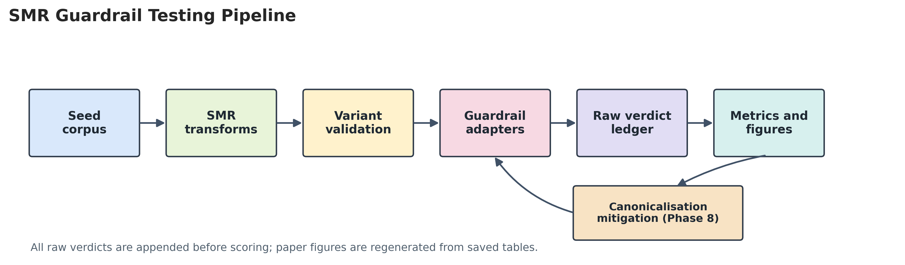
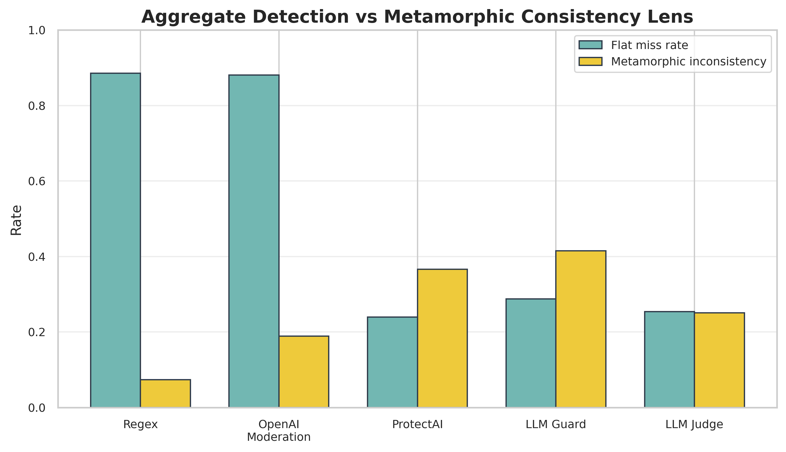
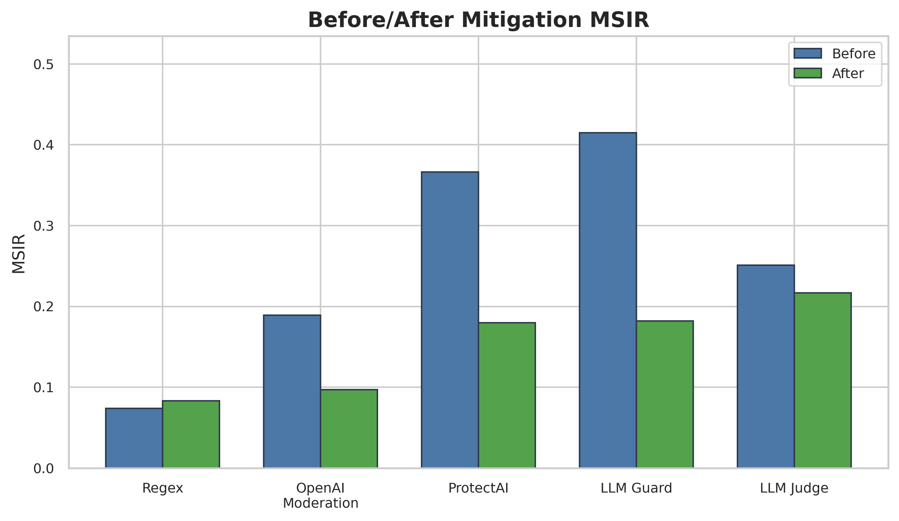

# Metamorphic Security Testing of LLM Application Guardrails

This repository contains the reproducible code for the paper project **"Metamorphic Security Testing of LLM Application Guardrails"**.

The project studies whether LLM application guardrails make stable security decisions when the same attack intent is paraphrased, translated, encoded, wrapped, split across turns, or evaluated under different authorization contexts.

In short: a guardrail may block one version of an attack but allow a semantically related version. This repository turns that behavior into a measurable security-testing problem.

## What This Project Does

The framework defines **Security Metamorphic Relations (SMRs)** for LLM guardrail evaluation. Instead of scoring each prompt independently, it groups related prompts and asks whether the guardrail preserves the expected security relation.

The pipeline:

1. Builds a curated seed corpus of security-relevant LLM application attacks.
2. Generates SMR variants such as paraphrases, translations, encodings, wrappers, access-control role changes, multi-turn compositions, and output payload encodings.
3. Validates whether generated variants preserve the intended security relation.
4. Runs multiple guardrails on each accepted variant.
5. Computes metamorphic consistency metrics, flat detection summaries, defense gaps, nondeterminism, paired McNemar tests, and mitigation results.
6. Applies canonicalization as a hardening layer and evaluates its effect.



## Why This Matters

LLM applications increasingly rely on guardrails to make security decisions before prompts reach tools, retrieval systems, internal context, or downstream output handlers.

Flat prompt-level benchmarks are useful, but they miss an important question:

> If two prompts preserve the same malicious intent, should the guardrail treat them consistently?

This project measures that gap using **Metamorphic Security Inconsistency Rate (MSIR)**:

```text
MSIR = inconsistent seed-SMR sets / observed seed-SMR sets
```

This is different from ordinary block rate or miss rate. A guardrail can have a high flat block rate and still be metamorphically inconsistent. A weak guardrail can also appear consistent simply because it misses related attacks consistently.



## When This Snapshot Was Produced

The current experiment and paper snapshot were finalized in June 2026.

The paper-facing run snapshot was refreshed on **2026-06-12 at 11:42:01 UTC** after completing:

- baseline guardrail evaluation,
- mitigated guardrail evaluation,
- deterministic-only canonicalization ablation,
- OpenAI moderation coverage,
- seed-baseline paired McNemar tests,
- expanded access-control checks,
- human validation audit.

## Key Results

The main experiment uses:

- **124 seeds**
- **3,273 accepted variants**
- **37 rejected variants**
- **5 guardrails**
- **7 Security Metamorphic Relations**
- **5 OWASP-linked risk categories**

Guardrails evaluated:

- `regex_baseline`
- `llmguard`
- `openai_moderation`
- `protectai`
- `llm_judge`

Headline results:

| Result | Value |
|---|---:|
| Baseline overall MSIR | `0.258986` |
| Baseline 95% CI | `[0.240553, 0.277419]` |
| Baseline inconsistent seed-SMR sets | `562 / 2,170` |
| Deterministic-only canonicalization MSIR | `0.191244` |
| Full canonicalization MSIR | `0.151613` |
| Deterministic-only relative reduction | `26.16%` |
| Full canonicalization relative reduction | `41.46%` |
| OpenAI moderation coverage | `3,273 / 3,273` for baseline, mitigated, and ablation |
| Human validation accepted-row confirmation | `30 / 30` |
| Human validation raw agreement | `0.55` |
| Human validation Cohen's kappa | `0.10` |

The human validation result is interpreted conservatively: reviewers confirmed every validator-accepted audit row, supporting the accepted corpus used in the experiments, but disagreed with many validator-rejected rows. This indicates that the rejection boundary is conservative and partly subjective.



## Repository Layout

```text
.
├── data/
│   ├── access_scenarios/       # SMR-5 access-control scenarios
│   ├── seeds/                  # committed seed corpus
│   └── variants/               # generated variants, ignored
├── docs/
│   └── assets/                 # README visuals
├── results/                    # generated raw results, ignored
├── src/
│   ├── access_app/             # role/context mini-app for SMR-5
│   ├── guardrails/             # guardrail adapters
│   ├── build_seeds.py
│   ├── generate_variants.py
│   ├── validate.py
│   ├── runner.py
│   ├── metrics.py
│   ├── canonicalize.py
│   ├── compute_mcnemar.py
│   ├── compute_second_annotator_agreement.py
│   ├── make_figures.py
│   └── check_paper_artifacts.py
├── reproduce.py                # smoke/full reproduction driver
├── requirements.txt
└── README.md
```

The manuscript, figures, tables, and run snapshots are generated into a sibling folder:

```text
../smr-paper/
```

That folder is intentionally not committed in this code repository.

## Security Metamorphic Relations

| SMR | Relation | Description |
|---|---|---|
| SMR-1 | Paraphrase invariance | Same malicious intent under paraphrase |
| SMR-2 | Translation invariance | Same attack intent translated across languages |
| SMR-3 | Encoding/obfuscation invariance | Same request under encodings or obfuscation |
| SMR-4 | Formatting/wrapping invariance | Same unsafe request inside wrappers such as JSON, email, XML, markdown, or support tickets |
| SMR-5 | Privilege/access-control differential | Same action under low-role and high-role contexts |
| SMR-6 | Composition/escalation differential | Individually lower-risk turns composed into a higher-risk request |
| SMR-7 | Output-sanitization invariance | Same output-handling payload under different encodings |

## Setup

Use Python 3.12. The current dependency set includes packages that do not yet target Python 3.13 consistently.

From PowerShell:

```powershell
cd smr-code
py -3.12 -m venv .venv
.\.venv\Scripts\Activate.ps1
python -m pip install --upgrade pip
pip install -r requirements.txt
```

Create a local `.env` file:

```powershell
Copy-Item .env.example .env
notepad .env
```

Set:

```text
OPENAI_API_KEY=your_key_here
```

Then test the key:

```powershell
python test_key.py
```

Never commit `.env`.

## Configuration

Important defaults:

| Setting | Default |
|---|---|
| Generation model | `gpt-5.4-mini` |
| LLM judge model | `gpt-5.4-mini` |
| Moderation model | `omni-moderation-latest` |
| Paper output folder | `../smr-paper/` |
| Raw results folder | `results/` |
| Generated variants folder | `data/variants/` |

You can override OpenAI models with:

```text
OPENAI_GENERATION_MODEL
OPENAI_JUDGE_MODEL
OPENAI_MODERATION_MODEL
```

## Quick Reproduction

Use the smoke profile for a fast local check:

```powershell
.\.venv\Scripts\Activate.ps1
python reproduce.py --profile smoke --dry-run
python reproduce.py --profile smoke --workers 2
```

The dry run prints the commands without executing them. The smoke run exercises the pipeline on a smaller subset.

## Full Reproduction

The full reproduction regenerates variants, runs guardrails, computes metrics, performs mitigation and ablation, builds figures, refreshes snapshots, and checks paper artifacts.

```powershell
.\.venv\Scripts\Activate.ps1
python reproduce.py --profile full --dry-run
python reproduce.py --profile full --workers 4
```

Full reproduction uses paid OpenAI API calls and local model inference. The local paper run estimated paid OpenAI cost at about **$33.72**, based on saved token accounting and runner estimates, not provider invoices.

If OpenAI moderation rate limits occur, resume only that guardrail with smaller batches:

```powershell
python src\runner.py --guardrails openai_moderation --workers 1 --moderation-batch-size 8 --moderation-sleep-seconds 60 --moderation-rate-limit-cooldown-seconds 300 --moderation-max-rate-limit-stalls 24
```

The runner is append-only and resumable. Completed `(variant_id, guardrail, repetition)` keys are skipped on restart.

## Step-by-Step Reproduction

You can also run the project phase by phase.

### 1. Build Seed Corpus

```powershell
python src\build_seeds.py
```

Writes:

- `data/seeds/seeds.jsonl`
- `../smr-paper/tables/seed_sample.csv`

### 2. Generate and Validate Variants

```powershell
python src\generate_variants.py
python src\repair_variants.py
python src\audit_variants.py --dedupe
python src\make_phase2_artifacts.py
```

Writes generated variants to `data/variants/` and paper tables to `../smr-paper/tables/`.

### 3. Smoke-Test Guardrails

```powershell
python src\smoke_guardrails.py --guardrails all
```

Writes:

- `../smr-paper/tables/baseline.csv`

### 4. Run Access-Control Mini-App

```powershell
python src\smoke_access_app.py
python src\make_phase4_artifacts.py
```

Writes:

- `../smr-paper/tables/access_control_smoke.csv`
- `../smr-paper/tables/access_control_summary.csv`
- `../smr-paper/figures/access_control_example.png`

### 5. Run Baseline Guardrail Evaluation

```powershell
python src\runner.py --estimate-only --workers 4
python src\runner.py --workers 4
```

Writes:

- `results/raw/results.jsonl`
- `../smr-paper/tables/runner_summary.csv`
- `../smr-paper/snapshots/phase5_runner_summary.json`

### 6. Compute Baseline Metrics

```powershell
python src\metrics.py --input results\raw\results.jsonl --variants data\variants\variants.jsonl --output-dir results\tables --paper-dir ..\smr-paper\tables --bootstrap-iterations 2000
```

Writes:

- `../smr-paper/tables/msir_overall.csv`
- `../smr-paper/tables/msir_by_guardrail.csv`
- `../smr-paper/tables/msir_by_guardrail_smr.csv`
- `../smr-paper/tables/coverage_summary.csv`
- `../smr-paper/tables/flat_detection_summary.csv`
- `../smr-paper/tables/defense_gap_summary.csv`

### 7. Compute Seed-Baseline McNemar Tests

```powershell
python src\make_seed_baseline.py
python src\compute_mcnemar.py --seed-results results\raw\seed_baseline_results.jsonl --variant-results results\raw\results.jsonl --output-dir results\tables_mcnemar --paper-dir ..\smr-paper\tables
```

Writes:

- `../smr-paper/tables/mcnemar_summary.csv`
- `../smr-paper/tables/mcnemar_by_smr.csv`

### 8. Generate Figures

```powershell
python src\make_figures.py
```

Writes PNG/PDF figure pairs to:

```text
../smr-paper/figures/
```

### 9. Run Canonicalization Mitigation

```powershell
python src\canonicalize.py --estimate-only
python src\canonicalize.py
python src\runner.py --variants data\variants\variants_canonicalized.jsonl --output results\raw\results_mitigated.jsonl --summary-output results\raw\runner_mitigated_summary.json --paper-summary ..\smr-paper\snapshots\phase8_runner_summary.json --paper-table ..\smr-paper\tables\runner_mitigated_summary.csv --workers 4
python src\metrics.py --input results\raw\results_mitigated.jsonl --variants data\variants\variants_canonicalized.jsonl --output-dir results\tables_mitigated --paper-dir ..\smr-paper\tables\mitigated --bootstrap-iterations 2000
python src\compute_mcnemar.py --seed-results results\raw\seed_baseline_results.jsonl --variant-results results\raw\results_mitigated.jsonl --output-dir results\tables_mitigated --paper-dir ..\smr-paper\tables\mitigated
python src\make_figures.py --mitigated-tables-dir results\tables_mitigated
```

Writes:

- `../smr-paper/tables/mitigated/`
- `../smr-paper/tables/mitigation.csv`
- `../smr-paper/figures/mitigation.png`

### 10. Run Deterministic-Only Ablation

```powershell
python src\canonicalize.py --mode full --skip-translation --output data\variants\variants_canonicalized_deterministic.jsonl --summary data\variants\canonicalization_deterministic_summary.json --paper-summary ..\smr-paper\snapshots\phase8_canonicalization_deterministic_summary.json
python src\reuse_identical_results.py --ablation-variants data\variants\variants_canonicalized_deterministic.jsonl --ablation-results results\raw\results_ablation_deterministic.jsonl
python src\runner.py --variants data\variants\variants_canonicalized_deterministic.jsonl --output results\raw\results_ablation_deterministic.jsonl --summary-output results\raw\runner_ablation_deterministic_summary.json --paper-summary ..\smr-paper\snapshots\ablation_deterministic_runner_summary.json --paper-table ..\smr-paper\tables\runner_ablation_deterministic_summary.csv --workers 4
python src\compute_mcnemar.py --seed-results results\raw\seed_baseline_results.jsonl --variant-results results\raw\results_ablation_deterministic.jsonl --output-dir results\tables_ablation_deterministic --paper-dir ..\smr-paper\tables\ablation_deterministic
python src\metrics.py --input results\raw\results_ablation_deterministic.jsonl --variants data\variants\variants_canonicalized_deterministic.jsonl --output-dir results\tables_ablation_deterministic --paper-dir ..\smr-paper\tables\ablation_deterministic --bootstrap-iterations 2000
python src\make_ablation_summary.py
```

### 11. Human Validation Agreement

After a completed anonymized human-validation CSV is available:

```powershell
python src\compute_second_annotator_agreement.py --completed ..\smr-paper\tables\human_validation_second_annotator_completed.csv
```

Writes:

- `../smr-paper/tables/second_annotator_agreement_summary.csv`

### 12. Final Artifact Gate

```powershell
python src\make_run_snapshot.py
python src\check_paper_artifacts.py
```

Writes:

- `../smr-paper/snapshots/run_snapshot.json`
- `../smr-paper/tables/paper_data_completeness.csv`

## Main Outputs

Paper-facing outputs are generated under `../smr-paper/`:

| Output | Location |
|---|---|
| Main manuscript draft | `../smr-paper/draft/full_manuscript_jisa_draft.md` |
| Figures | `../smr-paper/figures/` |
| Tables | `../smr-paper/tables/` |
| Run snapshot | `../smr-paper/snapshots/run_snapshot.json` |
| Artifact completeness report | `../smr-paper/tables/paper_data_completeness.csv` |

Generated raw data and large intermediate files stay local:

| Output | Location | Git status |
|---|---|---|
| Raw guardrail results | `results/` | ignored |
| Generated variants | `data/variants/` | ignored |
| API keys | `.env` | ignored |
| Virtual environment | `.venv/` | ignored |

## Reproducibility Notes

- The committed seed corpus is in `data/seeds/seeds.jsonl`.
- Generated variants are ignored but reproducible through `src/generate_variants.py`.
- Raw result ledgers are ignored because they can be large and may include model evidence.
- The runner is resumable and append-only.
- Local guardrail inference may depend on CPU/GPU availability and package versions.
- LLM-based guardrails may vary over time because hosted model behavior can change.
- OpenAI moderation results are tied to the moderation endpoint/model available at run time.

## Artifact Availability

This GitHub repository provides:

- source code,
- seed data,
- access-control scenarios,
- reproduction scripts,
- guardrail adapters,
- metric scripts,
- mitigation and ablation scripts,
- README reproduction instructions.

The paper artifacts are generated locally in the sibling `smr-paper/` folder and are excluded from this repository to keep the GitHub artifact focused on reproducible code.

## Citation

No DOI is assigned yet. For now, cite the repository URL:

```text
https://github.com/imranalmunyeem/metamorphic-testing-llm
```

## Author

**Imran Al Munyeem**  
Software Test Engineer, Easyask24 Ltd.  
Luton, UK  
Email: <munyeem.swe@gmail.com>  
ORCID: [0009-0007-3538-1172](https://orcid.org/0009-0007-3538-1172)

## Funding

This research received no external or institutional funding. All costs were borne solely by the author.

## Competing Interests

The author declares no competing interests.

## License

No license file is currently included. Unless a license is added, all rights are reserved by default.

## Git Hygiene

Do not commit:

- `.env`
- `.venv/`
- `results/`
- `data/variants/`
- large model caches
- private credentials
- paper drafts or generated paper artifacts from `../smr-paper/`
